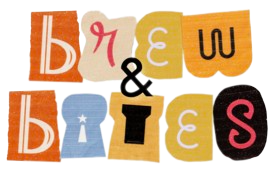

# 

Name: Brigitte Sharon Alexander

Class: L2AC

Course: Object Oriented Programming (COMP6699001)

#

## ⚙️ Description of Project
'Brew & Bites Billing System' is a billing management system that runs on Java. It has built in OOP properties as well as data structures. This application allows the administrator to add, update, remove buyers and products as well as manage the billing process. The management system provides features like placing products in stock, updating their details, and calculating the total for buyers (Details are in the report).

## 📚 Classes
- login.java
- homePage.java
- addBuyer.java
- deleteBuyer.java
- updateBuyer.java
- buyerDetails.java
- addProduct.java
- updateProduct.java
- productDetails.java 
- deleteProduct.java
- billingPage.java

- Connector.java (for SQL)
- user.java (for arrayList)
- userStorage.java (for arrayList)

#

## 📹 Video Demo Link
### https://drive.google.com/file/d/17yuXe23Pa8fNdQdva03fPRxoB99yYr3c/view?usp=drive_link
